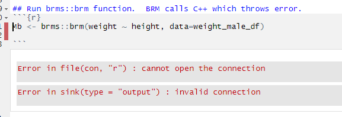
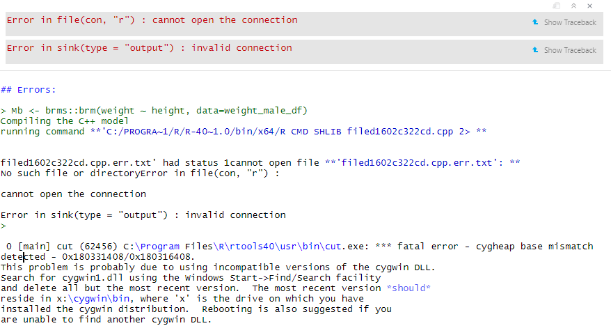
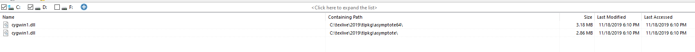

```{r setup, include=FALSE}
knitr::opts_chunk$set(echo = TRUE)
```


## Libraries
```{r}
library(brms)
library(readr)
library(tidyverse)
library(rstan)
library(here)
```


makevars_user()
library(tools)

# file:///C:/Program%20Files/R/R-4.0.0/library/tools/html/makevars.html
cat(tools::makevars_site())

# Calling C from R
# Reference http://adv-r.had.co.nz/C-interface.html

getwd()
  
  
### Sample data structure
```{r}
weight_df2 <- read_csv(here("weight_structure.csv"))
```
 

### Filter df2  
```{r}
weight_male_df <- weight_df2 %>% 
  filter(gender == 'male')

```


### Run brms::brm function.  BRM calls C++ which throws error.  
```{r}

Mb <- brms::brm(weight ~ height, data=weight_male_df)

```

### Errors:   


  
> Mb <- brms::brm(weight ~ height, data=weight_male_df)
Compiling the C++ model
running command **'C:/PROGRA~1/R/R-40~1.0/bin/x64/R CMD SHLIB filed1602c322cd.cpp 2> **


filed1602c322cd.cpp.err.txt' had status 1cannot open file **'filed1602c322cd.cpp.err.txt': **
No such file or directoryError in file(con, "r") : 

cannot open the connection

Error in sink(type = "output") : invalid connection
> 
   
 0 [main] cut (62456) C:\Program Files\R\rtools40\usr\bin\cut.exe: *** fatal error - cygheap base mismatch detected - 0x180331408/0x180316408.
This problem is probably due to using incompatible versions of the cygwin DLL.
Search for cygwin1.dll using the Windows Start->Find/Search facility
and delete all but the most recent version.  The most recent version *should*
reside in x:\cygwin\bin, where 'x' is the drive on which you have
installed the cygwin distribution.  Rebooting is also suggested if you
are unable to find another cygwin DLL.

  
  



### [Cygwin Reference](https://www.cygwin.com/faq.html#faq.what.supported)


### [RStan Issues]{https://github.com/stan-dev/rstan/issues/633)  
  
  
### Troubleshooting:
I used emacs, which makes it pretty easy to get to the document. The Stan getting started page also has instructions for modifying Makevars.win. One last point: the original poster had the directory RbuildTools in C; I did not. Instead I had Rtools. I created .Rprofile in my home directory with the below to fix that  

### Sys.setenv(BINPREF = "C:/Rtools/mingw_$(WIN)/bin/")  Did not work

weight_df <- read_csv("data/weight.csv")
weight_male_df <- weight_df %>% 
  filter(gender == 'male')


M <- lm(weight ~ height, data= weight_male_df)
M

### con <- file(system.file("C:\Program Files\R\R-4.0.0\"), open = "r")
### dyn.load("brms")
Mb <- brm(weight ~ height, data=weight_male_df)

sessionInfo()
.libPaths
library(brms)
library()

?# install.packages("rtools")

### getUrl(https://cran.r-project.org/bin/windows/Rtools/
#          )

### https://cran.r-project.org/bin/windows/Rtools/

###   Putting Rtools on the PATH
### After installation is complete, you need to perform one more step to be able to compile R packages: 
  # you need to put the location of the Rtools make utilities (bash, make, etc) on the PATH.
  # The easiest way to do so is create a text file .Renviron in your Documents folder which contains the following line:
<!-- #   PATH="${RTOOLS40_HOME}\usr\bin;${PATH}" -->
<!-- # You can do this with a text editor, or you can even do it from R like so: -->
<!-- #   writeLines('PATH="${RTOOLS40_HOME}\\usr\\bin;${PATH}"', con = "~/.Renviron") -->
<!-- # Now restart R, and verify that make can be found, which should show the path to your Rtools installation. -->
<!-- # Sys.which("make") -->
<!-- # ## "C:\\rtools40\\usr\\bin\\make.exe" -->
<!-- # If this works, you can try to install an R package from source: -->
<!-- #   install.packages("jsonlite", type = "source") -->
<!-- # If this succeeds, you’re good to go! See the links below to learn more about rtools40 and the Windows build infrastructure. -->
<!-- # Further Documentation -->
<!-- # More documentation about using rtools40 for R users and package authors: -->
<!-- #   Using pacman: the new rtools package manager to build and install C/C++ system libraries. -->
<!-- # Installing R packages: Some older R packages that need extra help to compile. -->
<!-- # FAQ: Common questions about Rtools40 and R on Windows. -->
<!-- # Advanced information about building R base and building system libr -->


<!-- aries: -->
<!-- #   r-base: Scripts for building R for Windows using rtools40. -->
<!-- # rtools-packages: Toolchains and static libraries for rtools40 (GCC 8+) -->
<!-- # rtools-backports: Backported C/C++ libraries for the gcc-4.9.3 legacy toolchain (for R 3.3 - 3.6) -->
<!-- # rtools-installer: Builds the rtools40 installer bundle. -->

R.version
R.version
